! Anycubic Kossel 心得

# Anycubic Kossel 心得

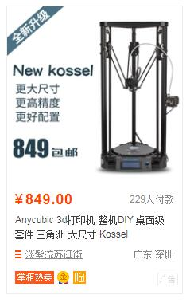

淘宝上最便宜的3d打印机，深圳anycubic公司出品。很多同学看到价格居然比2d打印机还便宜之后都想买，所以我就在这里把注意事项跟大家写一下吧，毕竟国货，光看说明书肯定是要出事的。

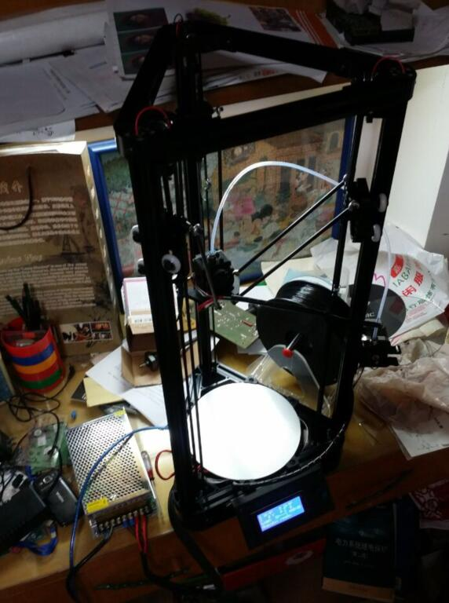

0. 滑车的问题

    anycubic kossel（下称AK）有滑车版和线轨版，一个是用塑料滑车作为轨道，一个是用线性滑轨作为轨道。滑车因为是塑料+橡胶，用力掰就会变形，所以打印的速度、加速度一高，滑车受力、抖动就大，精度就会下降。线性滑轨由于是金属的，刚度很高，就没有这个问题。因此价格差几百块钱可以理解。

    我买的是滑车版。

1. 热床的问题

    AK标配是玻璃床+床面贴纸，不带加热，贴纸表面是3d打印专用表面，对PLA附着力很强。基本上不用担心翘起，拆的时候要用刀子才能铲下来。（建议用刀刃宽而薄的刀子，铲刀最佳）

    我买的是带加热的版本，热床是一大块铝板，铝板背面有加热电路。正确的做法应该是把贴纸贴到铝板上，但是我脑抽了，把贴纸贴到了玻璃板上，再把玻璃板覆盖在铝板上，结果AK的热床固定件高度不足，只能卡住铝板和玻璃板中其一，没办法两个同时卡住。

    只用铝板作为热床表面是不行的，光滑的铝板表面PLA无法附着，会导致打印失败。我用kapton胶带（就是茶色胶带）覆盖了铝板表面，想着胶带也是高聚物，与PLA应该能附着吧，结果是附着力很差，打印到一半一不小心就把之前打印好的弄掉了。

    最终解决方案是在茶色胶带上用粗砂纸轻轻扫过，制造大量刮痕，提高附着力。这样打印的时候不会自己掉下来，打印好之后也不用动刀子，两全其美。

    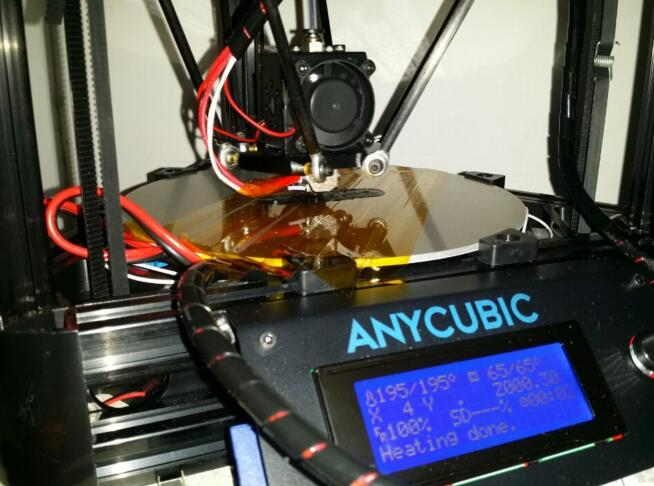

    对付台面不粘的另一个办法，是打印第一层和第二层的时候用非常低的速度（比如10mm/s），后面的层再慢慢加速。可以通过机器上的速度旋钮实现。

2. 固件的问题

    预先刷好的是无热床的固件，带热床的固件去商家网盘下载，安装较新版的arduino，然后烧写。烧写的时候注意，pronterface和cura之类能通过串口连接打印机的程序不要开启，因为它们占用了串口，arduino就没法烧写了。

3. 调平的问题

    千万不要在菜单里点level bed（调平打印床面），虽然固件支持，但是AK并没有Z probe（就是测量打印头是否触碰台面的开关），所以打印头会直接戳向铝板。运气不好的话就戳坏了。

    三角洲打印机的调平分两步，第一步是调节三个轴的偏移量，保证运动平面与立柱平行，不然三个轴有高有低的话，打印出来就是斜的。第二步是调整打印平面的凹凸——这是三角洲的特点，参数不正确的时候，实际打印平面可能是碗状的，也可能是拱形的，都会导致打印失败。

    在没有调平之前，不要尝试打印，不要把耗材插入机器。

    第一步当然是安装printrun软件，商家的网盘里面有，上网下载也行。printrun其实就是一个可以向打印机发送控制命令的界面。

    选择正确的串口（在设备管理器里找COMxx，其中xx是串口号），波特率250000，应该能连上打印机。软件的具体用法，G代码的意义，大家自己应该能搞明白。

    **搞不明白的千万不要买**。这里扩展说明一下，安装过程中有很多细节说明书都是没有讲的，但漏掉就会导致失败，所以如果不是DIY经验丰富，买回来一定是给自己找晦气。作者是电、计研究生水平，机械略懂一些，搞过CNC，单片机专业户，会说五种编程语言，仍然感到有大量知识需要学习，整整google了三天三夜。比如说热敏电阻要自己粘到热床背面，不然热床就会烧成火炉；比如加热头的热敏电阻要塞到加热头上的小孔里，然后想办法固定，不然掉出来的话就会不知不觉中把加热头烤红或者烫到自己；加热头和加热头散热片的连接是螺纹，但这个螺纹很松，一定要加生料带，上下用老虎钳固定拧紧，否则PLA会不知不觉渗得到处都是；滑车上的所有螺丝都必须拧紧，一颗螺丝没拧紧，就永远打印不出除了废品之外的东西；皮带一定要用送的弹簧张紧，越紧越好；安装限位开关要分清左右，不然滑车上面的螺丝顶不到限位开关……

    有一些细节没有随机器说明书发过来，要自己去商家的网盘看，这些细节都很重要，都得看。

    printrun（pronterface.exe)连上打印机之后，试试用G代码调节温度，试试G28归位……

    官方说明书提供的调平方法非常傻逼，如下：

    1. 测量Z轴实际最大运行距离
    2. 按照此距离，修改固件
    3. 打印点啥
    4. 如果打印出来一边高一边低，拧滑车上方的螺丝，改变滑车G28归位后的实际距离，从而改变每个轴的偏移量
    5. 重复3,4

    这样当然很痛苦，下面是我建议的调平方法：

    1. 修改固件。商家提供的是某个版本的Marlin改出来的，文件夹名字叫做“For linear and pulley - with hotbed”。修改之后如下：

        Configuration.h

        ```cpp
        // EEPROM
        // The microcontroller can store settings in the EEPROM, e.g. max velocity...
        // M500 - stores parameters in EEPROM
        // M501 - reads parameters from EEPROM (if you need reset them after you changed them temporarily).
        // M502 - reverts to the default "factory settings".  You still need to store them in EEPROM afterwards if you want to.
        //define this to enable EEPROM support
        #define EEPROM_SETTINGS
        //to disable EEPROM Serial responses and decrease program space by ~1700 byte: comment this out:
        // please keep turned on if you can.
        #define EEPROM_CHITCHAT
        ```

        这样修改之后，我们的AK就能够响应M500（把设置存到EEPROM中）命令，进而也就可以响应M666（对三条轨道增加修正量）命令了。

        由于AK固件对终点开关（endswitch）都是作常闭开关处理，而delta结构打印机并不需要x_min、y_min、z_min开关，所以这几个口都没有接常闭开关而是悬空，后果就是机器会认为这些开关一直处于被触发的状态。在这个状态下，虽然AK仍然可以正常打印，但是M666命令会失去效果，即G28归位之后，机器并不会按照M666命令所要求的，向下移动设定的偏移量。所以这里也需要修改固件，把xyz_min都设成常开开关。

        Configuration.h

        ```cpp
        // The pullups are needed if you directly connect a mechanical endswitch between the signal and ground pins.
        const bool X_MIN_ENDSTOP_INVERTING = true; // set to true to invert the logic of the endstop.
        const bool Y_MIN_ENDSTOP_INVERTING = true; // set to true to invert the logic of the endstop.
        const bool Z_MIN_ENDSTOP_INVERTING = true; // set to true to invert the logic of the endstop.
        const bool X_MAX_ENDSTOP_INVERTING = false; // set to true to invert the logic of the endstop.
        const bool Y_MAX_ENDSTOP_INVERTING = false; // set to true to invert the logic of the endstop.
        const bool Z_MAX_ENDSTOP_INVERTING = false; // set to true to invert the logic of the endstop.
        ```

        验证：在pronterface里，先G28归位，然后M666 x-10 y-10 z-10，然后M500，打印机应该返回“保存成功”。然后M501，看我们通过M666设置的内容，是否已经写入EEPROM。写入之后即便断电也是不会丢失的。然后再进行一次G28归位，看看三个轴在归位后，是不是又都下降了10mm？看来这种方法也能调节偏移量，而且不用调螺丝。（如果你真的想调螺丝：M3螺丝的螺距是0.5mm，如果要调节0.1mm，就拧1/5圈，以此类推。）

        验证完之后，记得复原M666设置（M666 x0 y0 z0, M500, M501），方便进行下一步。

    2. 将打印头移动到靠近x轴（打印机的x轴）处，点击界面上z轴（直角坐标系的z轴）向下1mm及向下0.1mm的按钮，直到打印头触底。为了避免打印头损坏，通常用一张白纸垫在打印头和床面之间，如果白纸来回抽动遇到阻力，就说明已经触底。

        用M114命令读取此时Z轴（直角坐标系的z轴）高度，比如说-30.5，说明在靠近x轴（打印机的X轴）处，床面的高度是-30.5mm。

        将打印头再分别移动到靠近y、z轴(打印机的y、z轴)处，也分别测量打印头触碰床面时，直角坐标系z轴的高度。把这三个高度记录下来。

        假如现在测量到了三个高度，分别是： 靠近x轴z=-30.5, 靠近y轴z=-30.9, 靠近z轴z=-31.2。这时如果想让直角坐标系的z=0平面和实际床面重合，就要给打印机x,y,z三个轴分别增加-30.5/-30.9/-31.2的偏移量。增加的方法之前已经提过：M666 x-30.5 y-30.9 z-31.2, M500, M501

    3. 将打印机G28归位（或者直接按绿色的z轴归位按钮），重复第2步，直到打印头无论在床面上方什么位置，向下移动到触碰床面时，通过M114读取的坐标系z轴高度均为0.

    上面这些步骤看上去很费时间，但如果把常用操作制作成pronterface里的按钮，通过点击按钮移动到靠近每个轴的地方，很快就能弄完了。用这种方式调节机器，比拧螺丝要精确，而且不用背诵螺丝的转动方向和角度。

    在打印的过程中，如果某一处的丝不粘平台，说明此处偏高；如果某一处的丝被压扁甚至不出丝，说明此处偏低，挤出头刮床；相应微调M666 +-0.1mm，再重新打印，直到效果完美为止。

    打印平面呈碗型和拱形的问题，也可以通过这种Z轴下探的方法测出来，然后按照说明书的指导，去修改固件即可。

3. 切片的问题

    我用cura软件切片（它提供的选项比较智能），然后把生成gcode扔到pronterface里预览和打印（它反馈的信息较全面）。将来我估计会自己写切片脚本。

    在模型周围一定要加衬线（skirt），它会在模型周围画一圈（也可以设成几圈）没有任何用途的线，可以使打印头送料通畅，把打印头上残留的PLA丝留在模型外边；最重要的是，如果出了任何问题（比如打印头刮台面，或者PLA不粘台面），可以在打印模型本身之前就发现并终止。

    

3. 温度的问题

    这个得根据实际耗材和速度,以及床面附着力设定。我热床设65度，这个温度下第一层略柔软，附着力增强。设成50度我的床面附着力不足。基本原则是，在床面能够附着的情况下，温度越低越好。

    挤出设成200度，设180度的话还没挤出来就被旁边的风扇吹冷了。PLA用180度（最低温度）的前提是挤出头的温度和显示器上的温度一致，实际上挤出头的温度会低一些，所以应该设定得高一些。一般来说，打印速度越快，温度也应该越高，避免流量大的时候挤出头被PLA过度冷却，导致细丝、断丝。

    PLA的性质类似玻璃，没有固定的熔点，在100度附近可以抽丝，在60度以上失去刚性，50度左右恢复刚性。每次作品打印完我会命令打印头移到台面上方，风扇开启，帮助台面降温；降到45度的时候就可以把打印好的作品拔下来了。因为PLA导热差，所以台面温度低于50度的时候，内部温度可能还很高。如果太早拔下来会造成作品底部变形。

## 风扇叶

扇叶厚度不到0.5mm，利用支撑打出来的，强度很好。

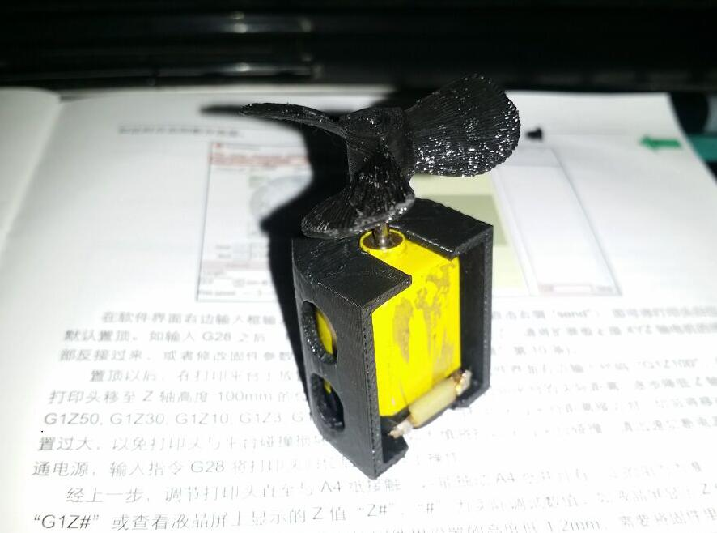

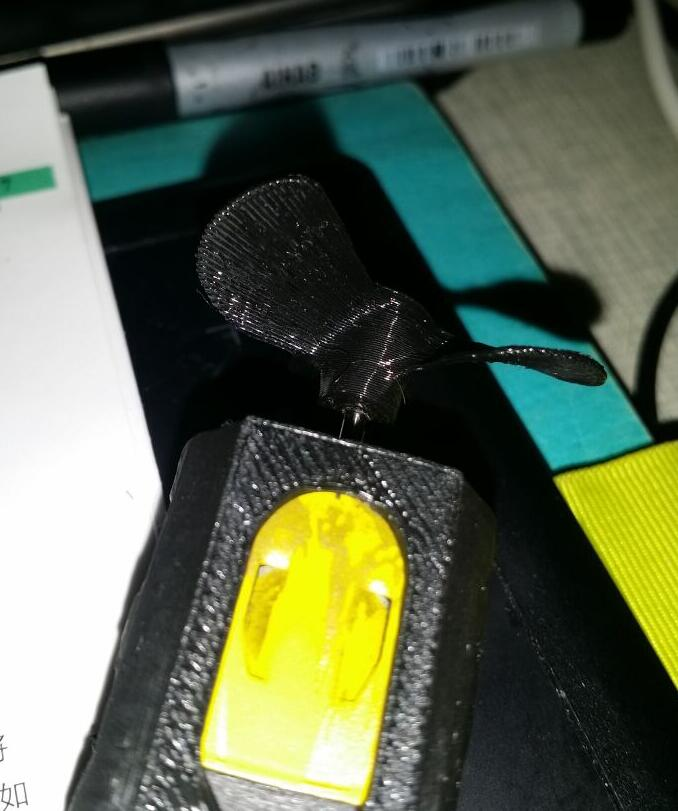

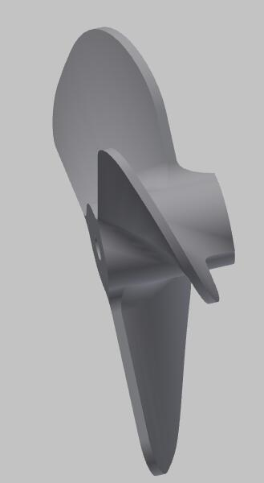

## 球轴承

终于为尘封多年的6mmABS塑料小球（你懂的）找到用途了。。。

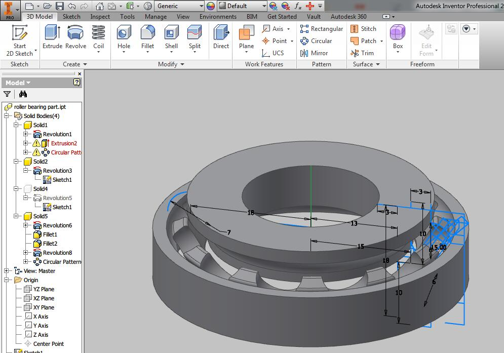

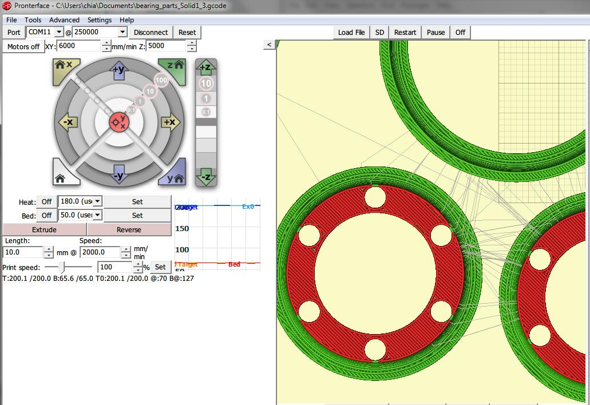

这个是滚珠架

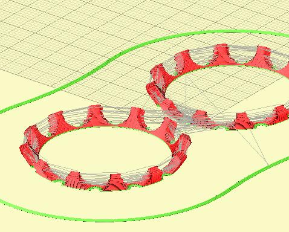
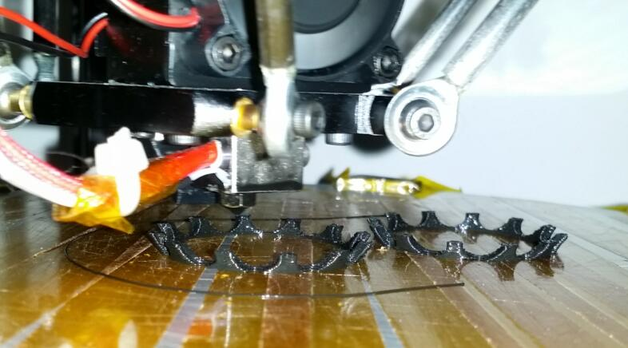

这个设计可以同时承受轴向和径向载荷:

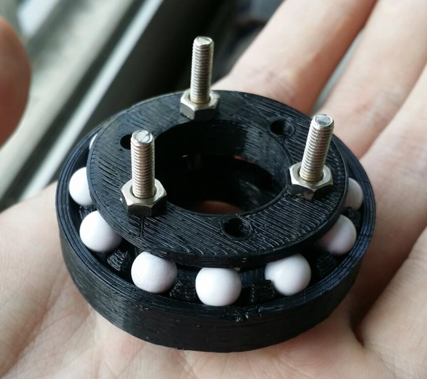
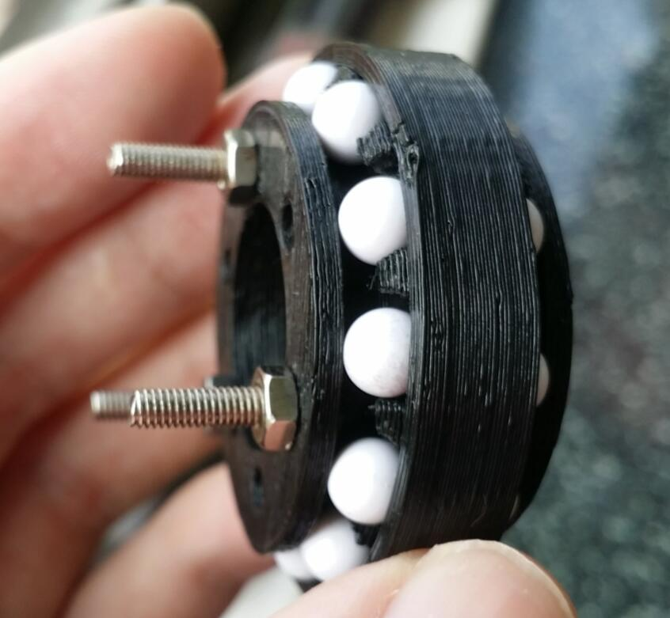

<div id="firmware"></div>

## Marlin bugfix-1.1.4 版固件 for AK

20170728更新

因为商家提供的旧版Marlin固件缺很多功能，无法满足我对精确打印的要求，所以这两天我上Github找了最新版的Marlin，修改后用在AK上。修改后的固件放在我的Github上，也就是[这里](https://github.com/ctmakro/Marlin/)。用最新版Arduino(1.8.3)可以烧写。

下面所提到的内容，都需要新固件的支持。

1. Z轴探头（Z Probe）

    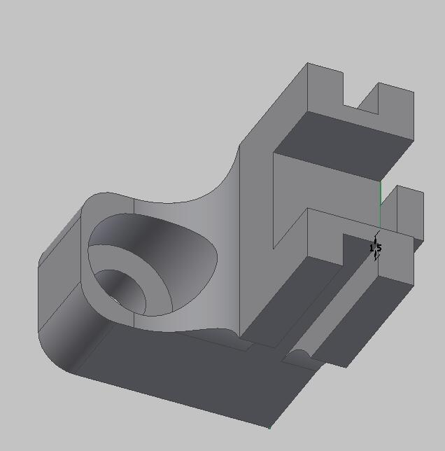

    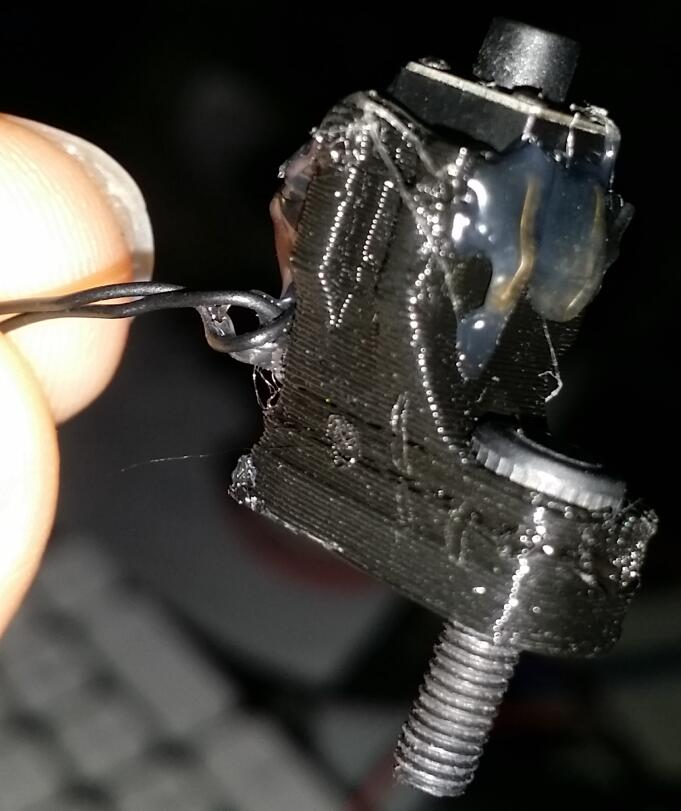

    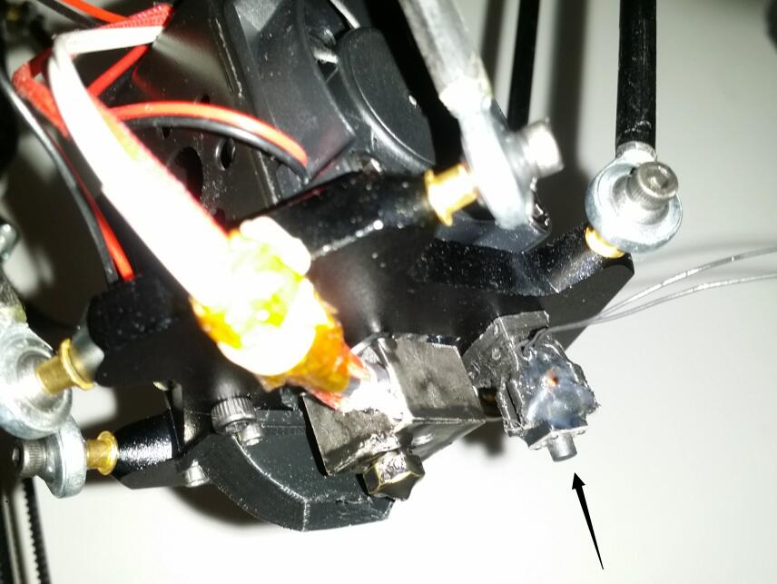

    支架是打印的，用M3螺丝拧在挤出头旁边，开关是普通的6*6mm微动开关，找了一个触发压力很小的，用新版固件的M48（测试机械开关的重复精度）命令测试，效果很好：

    ```text
    >>> M48
    SENDING:M48
    M48 Z-Probe Repeatability Test
    Finished!
    Mean: -79.754615 Min: -79.763 Max: -79.751 Range: 0.013
    Standard Deviation: 0.005730
    ```

    经过多次测量，最大误差只有0.013，标准差0.005，比台面精度不知高到哪里去了。

    因为探头比打印头要更长、更突出，所以通过探头测量到的距离，并不等于打印头和台面的实际距离。因此在使用这个探头前，要先测量探头和打印头的Z距离差，并用M851命令予以补偿（这些命令的具体使用，都请参考Marlin官网）。我的探头比打印头低1.09mm，所以我就M851 Z-1.09，然后M500、M501。

    探头和打印头的Z距离差是这样测量的：在装好探头的情况下，先G28归位，然后用G30让测量探头向下运动，测量碰到台面上某个固定高度的物体（比如一把尺子）时的Z高度：

    ```text
    >>> G30
    SENDING:G30
    Bed X: 15.00 Y: -20.00 Z: 15.15
    ```

    然后将挤出头抬高，并移动到物体之前与探头接触的位置的正上方，以0.1mm为步长慢慢降低挤出头，直到挤出头刚好抵住物体表面（用一张A4纸垫在挤出头和物体之间，当纸的自由运动受阻时，说明挤出头和物体之间距离已小于0.1mm）。此时用M114读取Z高度：

    ```text
    >>> M114
    SENDING:M114
    X:30.00 Y:-35.00 Z:14.01 E:0.00
    ```

    将两个Z高度相减(比如上面的14.01 - 15.15)，就得到了探头和打印头的Z距离差。

    > 打印机整体校准好之后，G30就可以当作卡尺，测量床面上放置的物体的高度。

2. 三角洲参数自动校正

    > 注意：在各个 G2x/G3x 命令开始前，请务必先G28归位，因为有的命令可能自带bug，缺少这一步，导致非常恐怖的情况发生。
    >
    > 如果认为恐怖的情况即将发生（比如打印头即将/已经撞向平台），急停的最快方法是在pronterface界面上双击Disconnect按钮。第二次点击会让计算机重新连上打印机，导致打印机重启。

    探头就位后，就可以通过G33命令进行多次自动测量，校正打印机的各种参数（包括工作半径、各塔的角度偏差等等），非常方便。不过，先别急着G33，读完下面的内容：

    G33校正的是这些参数：

    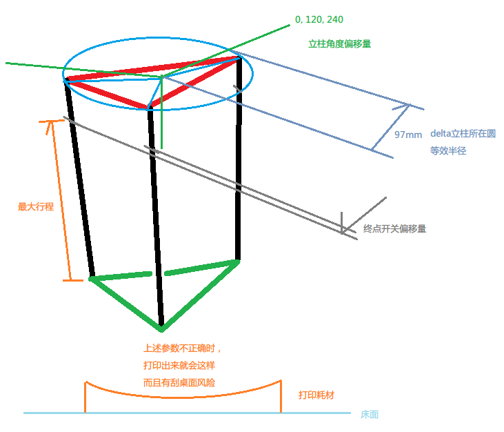

    这些参数，机器组装好之后校正一次，往后只要没有再拆装，就不需要再进行校正。这些参数也可以通过手动方法校正，然后通过M666、M665等命令写入，但是过程麻烦，精度也有限，还是自动的方法好。

    > 注意：三条立柱组装时必须严格相互平行！因为这个误差是没办法校正的。另外鱼眼距离（碳纤维杆的长度）也是测量得到的，作为其他一切校准的基础，如果这个长度测量不准确，就会造成打印件比例正确，但所有方向上的尺寸均有百分误差。anycubic在这一点上做得不错，鱼眼杆的长度就是217mm，非常精确，作为硬参数已经写到固件里。

    除了打印面的凹凸，参数的误差还会造成打印面的倾斜，以及不同方向上尺寸不对称（圆不圆、方不方）等问题。因为我主要是打印各种机械零件，所以这些问题对我的影响尤其大。有多大？只要打印一个网格图案：

    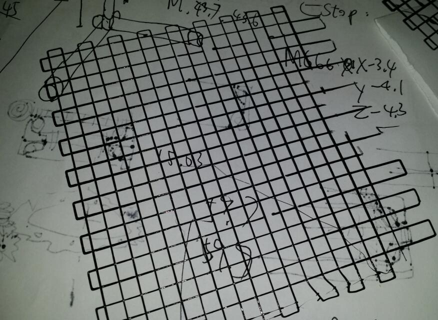

    把两次打印的结果，相隔90度叠在一起，就会发现两个轴的尺寸有1-2%误差：

    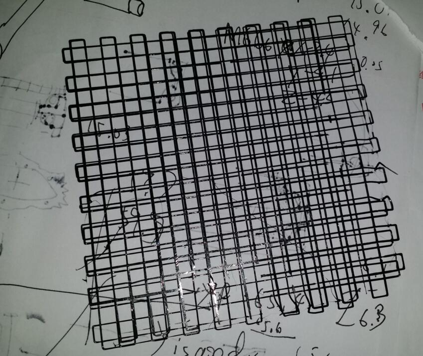

    在G33过程中发现一个问题，因为Z探头和打印头横向距离大概20mm（加热部件体积大，没办法装得太靠近），所以在有的测试点，Z探头会点到台面之外，而打印头会戳到床上，根本停不下来，十分恐怖。解决方法是减小测试半径，让测试点不要太接近床面的边缘。方法：在一切开始之前，输入命令：M665 B75 即可将测试半径限制到75mm。

    M665完了，再G33 P5（P5表示测量很多个点，并校准所有参数到较高精度），等待一个略微漫长的过程，看着探头上下运动……

    <iframe width="560" height="315" src="https://www.youtube.com/embed/F2oLUJQs0Bs" frameborder="0" allowfullscreen></iframe>

    最终得到输出如下：

    ```text
    >>> G33 P5
    SENDING:G33 P5
    G33 Auto Calibrate
    Checking... AC
    .Height:328.86    Ex:+0.00  Ey:+0.00  Ez:+0.00    Radius:97.00
    .Tower angle :    Tx:+0.00  Ty:+0.00  Tz:+0.00
    Iteration : 01                                    std dev:0.281
    .Height:328.53    Ex:+0.00  Ey:-0.72  Ez:-0.30    Radius:97.02
    .Tower angle :    Tx:+0.43  Ty:+0.01  Tz:+0.00
    Iteration : 02                                    std dev:0.128
    .Height:328.47    Ex:+0.00  Ey:-0.97  Ez:-0.30    Radius:96.94
    .Tower angle :    Tx:+0.66  Ty:-0.04  Tz:+0.00
    Iteration : 03                                    std dev:0.068
    .Height:328.45    Ex:+0.00  Ey:-1.09  Ez:-0.28    Radius:96.93
    .Tower angle :    Tx:+0.76  Ty:-0.10  Tz:+0.00
    Iteration : 04                                    std dev:0.048
    .Height:328.45    Ex:+0.00  Ey:-1.12  Ez:-0.21    Radius:96.96
    .Tower angle :    Tx:+0.82  Ty:-0.16  Tz:+0.00
    Iteration : 05                                    std dev:0.027
    .Height:328.47    Ex:+0.00  Ey:-1.11  Ez:-0.16    Radius:96.94
    .Tower angle :    Tx:+0.87  Ty:-0.20  Tz:+0.00
    Iteration : 06                                    std dev:0.032
    .Height:328.50    Ex:+0.00  Ey:-1.12  Ez:-0.10    Radius:96.95
    .Tower angle :    Tx:+0.89  Ty:-0.22  Tz:+0.00
    Iteration : 07                                    std dev:0.016
    .Height:328.49    Ex:+0.00  Ey:-1.13  Ez:-0.10    Radius:96.97
    .Tower angle :    Tx:+0.89  Ty:-0.24  Tz:+0.00
    Iteration : 08                                    std dev:0.016
    .Height:328.48    Ex:+0.00  Ey:-1.12  Ez:-0.11    Radius:96.94
    .Tower angle :    Tx:+0.90  Ty:-0.26  Tz:+0.00
    Calibration OK                                    rolling back.
    .Height:328.50    Ex:+0.00  Ey:-1.12  Ez:-0.10    Radius:96.95
    .Tower angle :    Tx:+0.89  Ty:-0.22  Tz:+0.00
    Save with M500 and/or copy to Configuration.h
    >>> M500
    SENDING:M500
    echo:Settings Stored (465 bytes; crc 19351)
    ```

    G33完了一定要紧接着M500保存，把参数写入EEPROM。从上面的输出来看，随着迭代次数(Iteration)增加，标准差(std dev)越来越小，最终收敛到0.016。高度328.50毫米，也正好是我这台AK之前手动校正时得到的Z轴行程。这时输入M501命令，发现校准结果已经写入EEPROM并可以读到。

    G33完了之后，先G28归位，再输入G1 Z5，看看挤出头是不是正好停在台面上方5毫米处。或者G28归位，再G30测量台面高度，看返回的Z值是不是在+-0.05mm以内。如是则校正成功。

    因为这个校正跑一次时间比较长，所以如果仅仅是更换了床面，可以不用重新G33，而可以用G29专门对床面的倾斜和位移进行校正。不过这个功能在Marlin固件里面bug比较多，暂时不推荐大家用，以后如果确实要用到，我会再更新G29相关的内容。

    校准之后，把探头拆掉，然后打印一个空心立方体，挤出头紧贴床面效果很好：

    

    把网格图案拿出来打印了一遍，经测量，xy尺寸相等，误差在0.1%以下。终于脱离了沦为玩具的命运。

    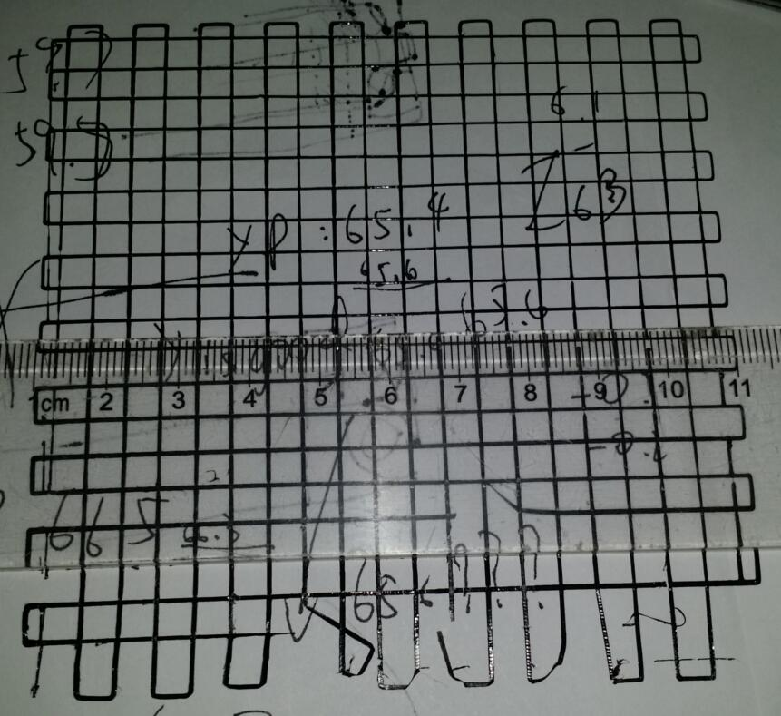

    总结：只要固件好，鸟枪当大炮

    <!---
      在床面中心测量，Z接近0；此时如果移动到床的边缘，测量到的Z仍然比较大。这是因为G33只校正了打印机参数，但是没有校正床面，床面的倾斜并没有得到补偿。所以下一步是床面调平。

    3. 床面自动调平

      G29 命令已经在固件中设置成三点模式，会在台面上的三个位置采集Z高度，并计算相应的补偿参数。三个采样点分别是：

      ```cpp
      // 3 arbitrary points to probe.
      // A simple cross-product is used to estimate the plane of the bed.
      #define ABL_PROBE_PT_1_X -60
      #define ABL_PROBE_PT_1_Y -35
      #define ABL_PROBE_PT_2_X 60
      #define ABL_PROBE_PT_2_Y -35
      #define ABL_PROBE_PT_3_X 0
      #define ABL_PROBE_PT_3_Y 70
      ```

      操作顺序：

      1. G28
      2. G29
    --->

4. 挤出头PID自动调节

    这个不多说了，先

    ```text
    >>> m303 s180 e0 c8 u
    SENDING:M303 S180 E0 C8 U
    PID Autotune start
     bias: 94 d: 94 min: 177.36 max: 184.89
     bias: 90 d: 90 min: 177.25 max: 183.35
     bias: 89 d: 89 min: 177.41 max: 182.93 Ku: 41.07 Tu: 23.76
     Classic PID
     Kp: 24.64 Ki: 2.07 Kd: 73.17
     bias: 89 d: 89 min: 177.59 max: 182.56 Ku: 45.65 Tu: 22.94
     Classic PID
     Kp: 27.39 Ki: 2.39 Kd: 78.54
     bias: 88 d: 88 min: 177.78 max: 182.73 Ku: 45.28 Tu: 22.94
     Classic PID
     Kp: 27.17 Ki: 2.37 Kd: 77.89
     bias: 88 d: 88 min: 177.59 max: 182.59 Ku: 44.88 Tu: 22.94
     Classic PID
     Kp: 26.93 Ki: 2.35 Kd: 77.21
     bias: 88 d: 88 min: 177.73 max: 182.59 Ku: 46.17 Tu: 23.10
     Classic PID
     Kp: 27.70 Ki: 2.40 Kd: 79.99
     bias: 89 d: 89 min: 177.50 max: 182.59 Ku: 44.57 Tu: 23.27
     Classic PID
     Kp: 26.74 Ki: 2.30 Kd: 77.77
    PID Autotune finished! Put the last Kp, Ki and Kd constants from below into Configuration.h
    #define  DEFAULT_Kp 26.74
    #define  DEFAULT_Ki 2.30
    #define  DEFAULT_Kd 77.77
    ```

    然后M500保存。

    热床不是用PID，而是用ping pong大法控制的，所以不用校准。我试过热床用PID，效果不如ping pong（在固件里叫“bang bang”）好。

<div id="pulley"></div>

## 滑车改造消回差 Pulley Upgrade for Kossel Deltas with backlash

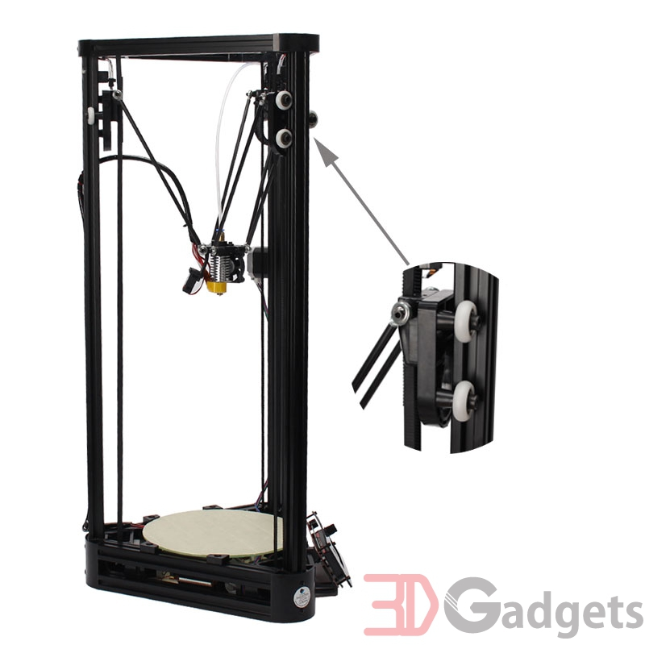

原版的滑车个别回差比较大，会把比较小的圆画成椭圆，有些尖锐的角会画成圆角。

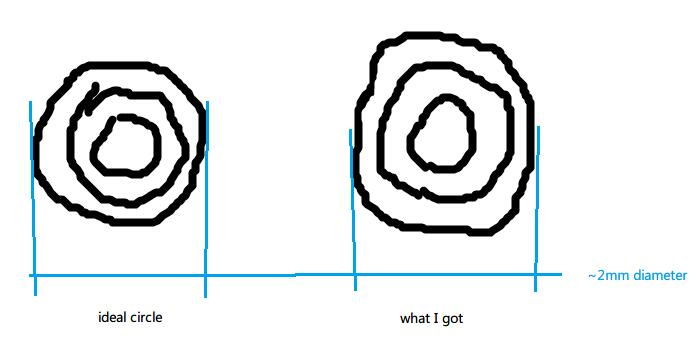

误差可大至0.5毫米。所以就产生了一种印象：要提高精度，就必须把滑车换成线轨。

The original pulley design have severe backlash, causing the printer to draw small circles into ellipses, sharp edges into rounded edges. The error could be up to about 0.5mm. Thus we tend to believe that in order to increase the accuracy we must discard the pulley and use linear bearing instead.

其实只要用手去扳一下安装好的滑车，就会发现滑车的设计有很严重的问题，即便所有的螺丝都拧到最紧，滑车仍然会晃，挤出头仍然可以摇动。到底是什么问题？我画了一张图作说明：

Well actually if you move the installed pulley you will notice there are numerous design flaws present, that the pulley, and therefore the extrusion, could still wiggle even when all the screws are tightened. I drew a sketch to show why.

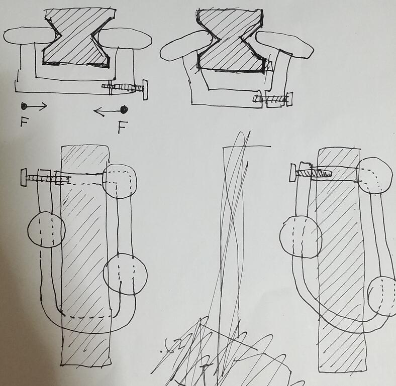

左上：理想状态 右上：实际情况 左下：理想状态 右下：实际情况

upleft: ideal upright: actual downleft:ideal downright: actual

一番分析之后，我决定设计一款能够让三个滑轮受力均衡，将轨道真正夹紧的滑车：

After some analysis I decided to design a pulley that could balance the forces between wheels and hold the rail tight:

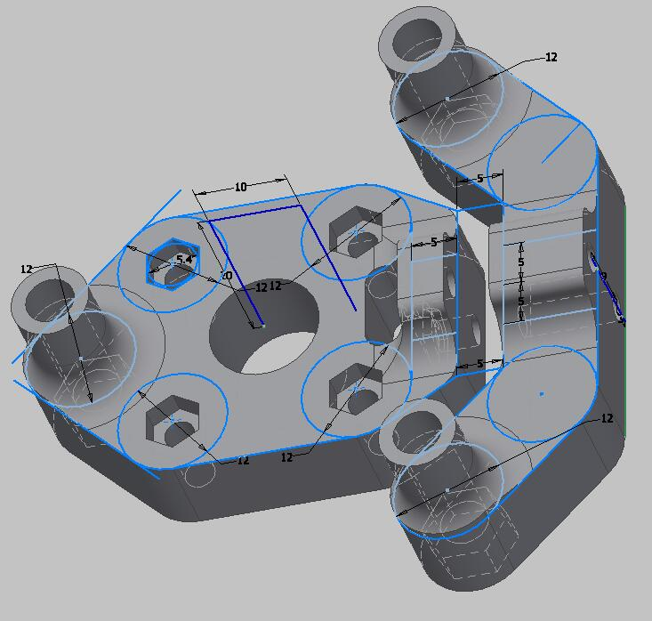

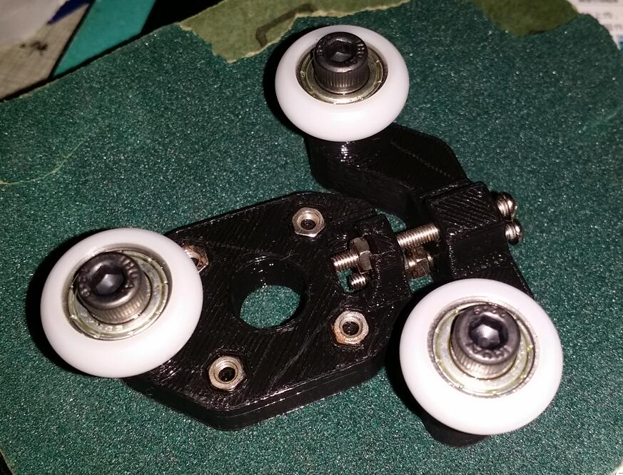

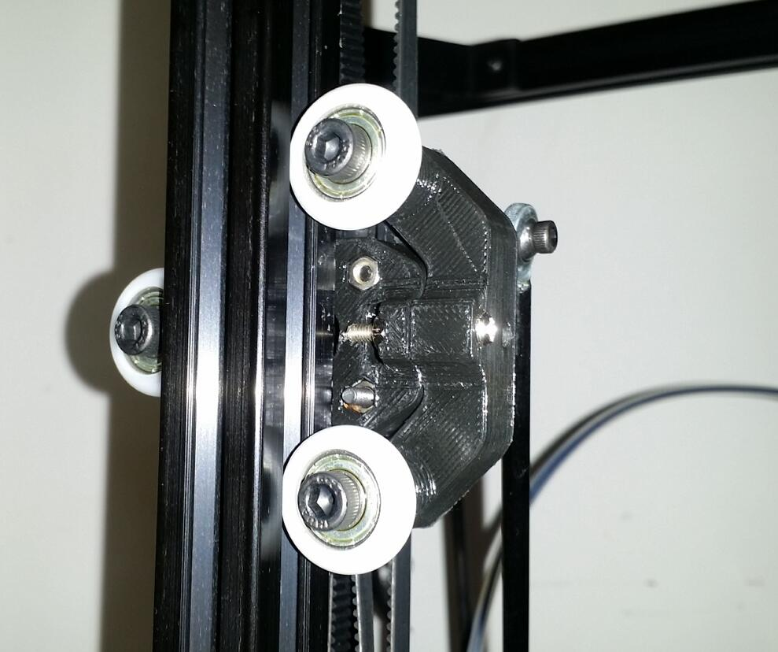

装好之后我发现我的新设计仍然有改进的空间。但即便这样，现在这个设计也已经比原版好很多了，从上下推拉滑车的手感就能感觉出来。

After installation I noticed that my design could be further improved. But even so my current design is much better than the original, you can tell from the feeling of pulling the pulley up and down.

由于我的设计比原版要矮1毫米，所以我把探头装上，运行一次 G33 P5 之后，机器的等效半径从96.95增加到了97.28。

Since my new design is 1mm thinner than the original, the z-probe is installed and a G33 P5 is ran, and my RADIUS has gone from 96.95 to 97.28:


```text
>>> g33p5
SENDING:G33P5
G33 Auto Calibrate
Checking... AC
.Height:329.52    Ex:+0.00  Ey:-1.12  Ez:-0.10    Radius:96.95
.Tower angle :    Tx:+0.89  Ty:-0.22  Tz:+0.00
Iteration : 01                                    std dev:0.241
.Height:329.76    Ex:+0.00  Ey:-0.74  Ez:-0.28    Radius:97.10
.Tower angle :    Tx:+1.49  Ty:-0.02  Tz:+0.00

...

Iteration : 09                                    std dev:0.015
.Height:329.71    Ex:+0.00  Ey:-1.09  Ez:-0.22    Radius:97.30
.Tower angle :    Tx:+2.61  Ty:+0.37  Tz:+0.00
Calibration OK                                    rolling back.
.Height:329.71    Ex:+0.00  Ey:-1.07  Ez:-0.22    Radius:97.28
.Tower angle :    Tx:+2.54  Ty:+0.34  Tz:+0.00
Save with M500 and/or copy to Configuration.h
```

不错。然后我对设计进行了微调，再次打印：

Which is fine. Then I changed my design slightly and printed again:

<iframe width="560" height="315" src="https://www.youtube.com/embed/SD7qccoEEdM" frameborder="0" allowfullscreen></iframe>


我用白色箭头标出了每组螺丝对弯月形部分施加的作用力。

I marked the force applied to the moon-shaped piece by each set of screws with white arrows.

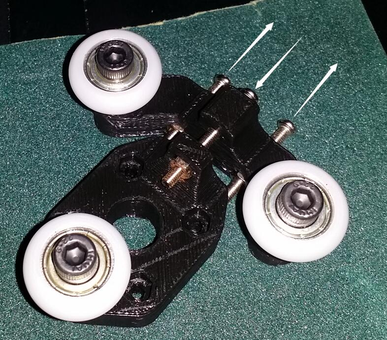

然后安装到另一条立柱上：

Then installed it on another rail:

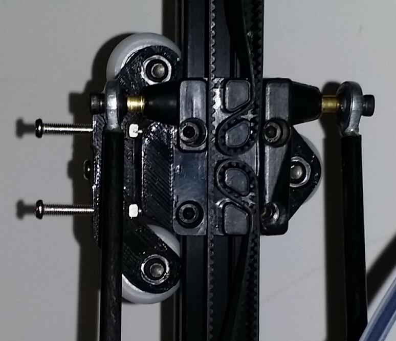

这次的设计需要用三颗螺丝紧固，能够非常精确地调节每个尼龙轮的受力的大小和方向，确保上下均匀，不内嵌不外翻。最终效果非常好，滑车上下滑动如丝般顺滑，但左右摇则纹丝不动，彻底消除回差。

This new design requires 3 screws, could precisely adjust the direction and magnitude of force on each of the wheels, and make sure they are even in every direction. The result is fantastic, the pulley could slide up and down freely, but could barely wiggle horizontally. The backlash is now completely eliminated.

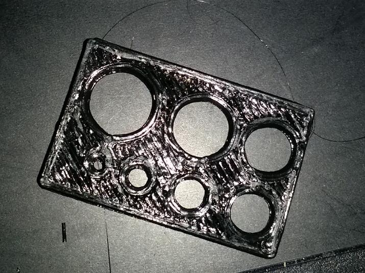

打印结果：所有的圆孔都圆了。由于定位精度提高，打印的稳定性也得到了提高。现在这台打印机可以以很高的速度、很高的精度进行打印了。

Result: all the holes are round now. Stability of printing increased as a result of the increased positioning accuracy. Now the printer can print very fast and accurately.

最终我把三个滑车全换成了这种新设计的滑车。我把滑车的STL文件附在下方，供各位下载。

Finally I replaced all three pulleys with my new design. You can download the STL file for the pulley below.

[pulley_for_kossel_new_design.zip](pulley_for_kossel_new_design.zip) (for 20mm*20mm aluminum rail and nylon wheels)
